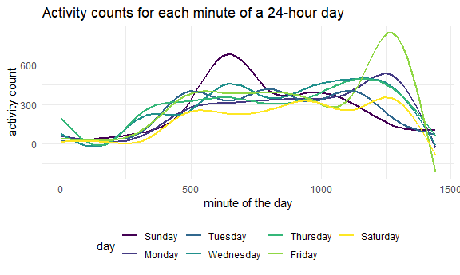
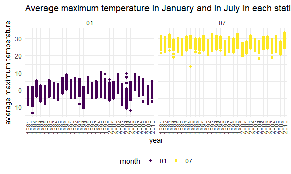
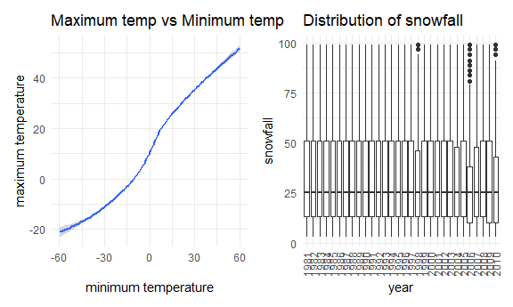

Homework 3 solutions
================
Yanhao Li
10/9/2020

### Problem 1

``` r
data("instacart")
```

Short description of the dataset:

This dataset contains 1384617 rows and 15 columns.

Observations are the level of items in orders by user. There are user /
order variables – user ID, order ID, order day and order hour. There are
also item variables – name, aisle, department, and some numeric codes.

How many aisles, and which are most items from?

``` r
instacart %>% 
  count(aisle) %>% 
  arrange(desc(n))
```

    ## # A tibble: 134 x 2
    ##    aisle                              n
    ##    <chr>                          <int>
    ##  1 fresh vegetables              150609
    ##  2 fresh fruits                  150473
    ##  3 packaged vegetables fruits     78493
    ##  4 yogurt                         55240
    ##  5 packaged cheese                41699
    ##  6 water seltzer sparkling water  36617
    ##  7 milk                           32644
    ##  8 chips pretzels                 31269
    ##  9 soy lactosefree                26240
    ## 10 bread                          23635
    ## # ... with 124 more rows

Let’s make a plot.

``` r
instacart %>% 
  count(aisle) %>% 
  filter(n > 10000) %>% 
  mutate(
    aisle = factor(aisle),
    aisle = fct_reorder(aisle, n)
  ) %>% 
  ggplot(aes(x = aisle, y = n)) +
  geom_point() +
  theme(axis.text.x = element_text(angle = 90, vjust = 0.5, hjust = 1))
```


Let’s make a table.

``` r
instacart %>% 
  filter(aisle %in% c("baking ingredients", "dog food care", "packaged vegetables fruits")) %>% 
  group_by(aisle) %>% 
  count(product_name) %>% 
  mutate(rank = min_rank(desc(n))) %>% 
  filter(rank < 4) %>% 
  arrange(aisle, rank) %>% 
  knitr::kable()
```

| aisle                      | product\_name                                 |    n | rank |
| :------------------------- | :-------------------------------------------- | ---: | ---: |
| baking ingredients         | Light Brown Sugar                             |  499 |    1 |
| baking ingredients         | Pure Baking Soda                              |  387 |    2 |
| baking ingredients         | Cane Sugar                                    |  336 |    3 |
| dog food care              | Snack Sticks Chicken & Rice Recipe Dog Treats |   30 |    1 |
| dog food care              | Organix Chicken & Brown Rice Recipe           |   28 |    2 |
| dog food care              | Small Dog Biscuits                            |   26 |    3 |
| packaged vegetables fruits | Organic Baby Spinach                          | 9784 |    1 |
| packaged vegetables fruits | Organic Raspberries                           | 5546 |    2 |
| packaged vegetables fruits | Organic Blueberries                           | 4966 |    3 |

Apples vs ice cream ..

``` r
instacart %>% 
  filter(product_name %in% c("Pink Lady Apples", "Coffee Ice Cream")) %>% 
  group_by(product_name, order_dow) %>% 
  summarize(mean_hour = mean(order_hour_of_day)) %>% 
  pivot_wider(
    names_from = order_dow,
    values_from = mean_hour
  )
```

    ## `summarise()` regrouping output by 'product_name' (override with `.groups` argument)

    ## # A tibble: 2 x 8
    ## # Groups:   product_name [2]
    ##   product_name       `0`   `1`   `2`   `3`   `4`   `5`   `6`
    ##   <chr>            <dbl> <dbl> <dbl> <dbl> <dbl> <dbl> <dbl>
    ## 1 Coffee Ice Cream  13.8  14.3  15.4  15.3  15.2  12.3  13.8
    ## 2 Pink Lady Apples  13.4  11.4  11.7  14.2  11.6  12.8  11.9

### Problem 2

Load, tidy and otherwise wrangle the data.

``` r
accel_df =
  read_csv("./accel_data.csv") %>% 
  janitor::clean_names() %>% 
  pivot_longer(
    activity_1:activity_1440,
    names_to = "minute_of_the_day",
    names_prefix = "activity_",
    values_to = "activity_count"
  ) %>% 
  mutate(
    day = factor(
      day, 
      levels = c("Sunday", "Monday", "Tuesday", "Wednesday", "Thursday", "Friday", "Saturday")
      ),
    minute_of_the_day = as.numeric(minute_of_the_day),
    weekday_vs_weekend = recode(
      day,
      Monday = "weekday",
      Tuesday = "weekday",
      Wednesday = "weekday",
      Thursday = "weekday",
      Friday = "weekday",
      Saturday = "weekend",
      Sunday = "weekend"
    ),
    weekday_vs_weekend = factor(weekday_vs_weekend)
  ) %>% 
  arrange(week, day) %>% 
  select(-day_id)
```

    ## Parsed with column specification:
    ## cols(
    ##   .default = col_double(),
    ##   day = col_character()
    ## )

    ## See spec(...) for full column specifications.

Describe the resulting dataset:

The resulting dataset contains variables including week, day,
minute\_of\_the\_day, activity\_count, weekday\_vs\_weekend. I arrange
the dataset according to “week” variable firstly, then by “day”
variable. “minute\_of\_the\_day” variable shows each minute at specific
day of the specifc week. “activity\_count” variable shows activity
counts for each minute of a 24-hour day starting at midnight.
“weekday\_vs\_weekend” variable shows type of this day.

In total, there are 50400 observations.

Create a table showing total activity over the days.

``` r
accel_df %>% 
  group_by(week, day) %>% 
  summarize(activity_of_the_day = sum(activity_count)) %>% 
  pivot_wider(
    names_from = day,
    values_from = activity_of_the_day
  )
```

    ## `summarise()` regrouping output by 'week' (override with `.groups` argument)

    ## # A tibble: 5 x 8
    ## # Groups:   week [5]
    ##    week Sunday  Monday Tuesday Wednesday Thursday  Friday Saturday
    ##   <dbl>  <dbl>   <dbl>   <dbl>     <dbl>    <dbl>   <dbl>    <dbl>
    ## 1     1 631105  78828. 307094.   340115.  355924. 480543.   376254
    ## 2     2 422018 295431  423245    440962   474048  568839    607175
    ## 3     3 467052 685910  381507    468869   371230  467420    382928
    ## 4     4 260617 409450  319568    434460   340291  154049      1440
    ## 5     5 138421 389080  367824    445366   549658  620860      1440

Trend apparent:

On Tuesday, Wednesday, and Thursday, total activities over the day are
relatively stable. In weekend, there is an apparent trend of decrease.

Make a single panel plot.

``` r
accel_df %>% 
    ggplot(aes(x = minute_of_the_day, y = activity_count, color = day)) +
  geom_smooth(se = FALSE) + 
    labs(
      title = 'Activity counts for each minute of a 24-hour day',
      x = 'minute of the day',
        y = 'activity count'
        )
```

    ## `geom_smooth()` using method = 'gam' and formula 'y ~ s(x, bs = "cs")'



Describe any patterns or conclusions I can make based on this graph:

From the plot, the 63 year-old male might sleep from 11:30 p.m to 7:00
a.m. On Sunday, he is more active than the other days in the morning. On
Sunday and Tuesday, he is less active than the other days in the
evening.

### Problem 3

``` r
data("ny_noaa")
```

Short description of the dataset:

This dataset contains 2595176 rows and 7 columns.

Observations are the level of daily variables in orders by station ID
and date. There are daily variables – maximum and minimum temperature,
total daily precipitation, snowfall, and snow depth. There are also
station / date variables – weather station ID and date of observation.

Do some data cleaning.

``` r
ny_cli = 
  ny_noaa %>%
    janitor::clean_names() %>% 
    separate(date, c('year','month','day')) %>% 
  mutate(
    prcp = as.numeric(prcp),
    snow = as.numeric(snow),
    snwd = as.numeric(snwd),
    tmax = as.numeric(tmax),
    tmin = as.numeric(tmin),
    prcp_mm = prcp / 10,
    snow_mm = snow,
    snwd_mm = snwd,
    tmax_c = tmax / 10,
    tmin_c = tmin / 10
  ) %>% 
  select(-prcp, -snow, -snwd, -tmax, -tmin)

ny_cli %>% 
  count(snow_mm) %>% 
  arrange(desc(n))
```

    ## # A tibble: 282 x 2
    ##    snow_mm       n
    ##      <dbl>   <int>
    ##  1       0 2008508
    ##  2      NA  381221
    ##  3      25   31022
    ##  4      13   23095
    ##  5      51   18274
    ##  6      76   10173
    ##  7       8    9962
    ##  8       5    9748
    ##  9      38    9197
    ## 10       3    8790
    ## # ... with 272 more rows

Most commonly observed value for snowfall:

The most commonly observed value for snowfall is 0. For most of the
time, there is no snow in NY.

Make a two-panel plot.

``` r
ny_cli %>% 
  filter(month %in% c("01", "07")) %>% 
  filter(!is.na(tmax_c)) %>%
  group_by(id, year, month) %>% 
  summarize(
    tmax_mean = mean(tmax_c)
    ) %>% 
  ggplot(aes(x = year, y = tmax_mean, color = month, group = id)) +
  geom_point() +
  labs(
    title = "Average maximum temperature in January and in July in each station across years",
    x = "year",
    y = "average maximum temperature"
  ) +
  facet_grid(. ~ month) +
  theme(axis.text.x = element_text(angle = 90, vjust = 0.5, hjust = 1))
```

    ## `summarise()` regrouping output by 'id', 'year' (override with `.groups` argument)



Observable / interpretable structure and outliers:

Generally, the average maximum temperature is increasing in January.
There is also a “tide” pattern can be observed. Every 10 to 12 years,
there are years apparently colder than others around it. Examples
include 1982, 1994, and 2004. In January of 1982, 1993, and 2005, the
outliers indicate that some place of NY is much colder than the other
places.

Generally, the average maximum temperature is quite stable in July. In
July of 1988, the outlier indicates that some place of NY is much colder
than the other places.

Make a two-panel plot.

``` r
tmax_vs_tmin = 
  ny_cli %>% 
    ggplot(aes(x = tmin_c, y = tmax_c)) +
    geom_smooth() +
    labs(
      title = "Maximum temp vs Minimum temp",
        x = "minimum temperature",
        y = "maximum temperature"
    )

dis_snowfall = 
  ny_cli %>% 
  filter(snow_mm > 0, snow_mm < 100) %>% 
    ggplot(aes(x = year, y = snow_mm)) +
    geom_boxplot() +
    labs(
      title = "Distribution of snowfall",
      x = "year",
        y = "snowfall"
    ) +
    theme(axis.text.x = element_text(angle = 90, vjust = 0.5, hjust = 1))

tmax_vs_tmin + dis_snowfall
```

    ## `geom_smooth()` using method = 'gam' and formula 'y ~ s(x, bs = "cs")'

    ## Warning: Removed 1136276 rows containing non-finite values (stat_smooth).


